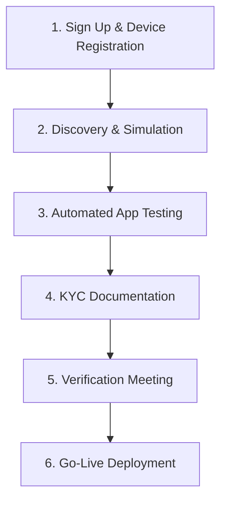

<p align="center">
  <a href="https://paybill.ke" target="_blank">
    <picture>
      <source media="(prefers-color-scheme: dark)" srcset="https://paybill.ke/logo-wordmark--dark.png">
      
    </picture>
  </a>
</p>

# KRA eTIMS OSCU Integration SDK (JavaScript/TypeScript)


A production-ready **TypeScript SDK** for integrating with the Kenya Revenue Authority (KRA) **eTIMS OSCU** (Online Sales Control Unit) API. Built to match the official Postman collection specifications with strict header compliance, token management, and comprehensive Joi validation.

> ⚠️ **Critical Note**: This SDK implements the **new OSCU specification** (KRA-hosted), *not* the VSCU eTIMS API. OSCU requires device registration, headers, and `cmcKey` lifecycle management.

## Author
**Bartile Emmanuel**  
📧 ebartile@gmail.com | 📱 +254757807150  
*Lead Developer, Paybill Kenya*

---

## Table of Contents
- [Introduction to eTIMS OSCU](#introduction-to-etims-oscu)
- [OSCU Integration Journey](#oscu-integration-journey)
- [Critical Requirements](#critical-requirements)
- [Features](#features)
- [Installation](#installation)
- [Configuration](#configuration)
- [Usage Guide](#usage-guide)
- [API Reference](#api-reference)
- [Field Validation Rules](#field-validation-rules)
- [Error Handling](#error-handling)
- [Troubleshooting](#troubleshooting)
- [Automated Testing Requirements](#automated-testing-requirements)
- [KYC Documentation Checklist](#kyc-documentation-checklist)
- [Go-Live Process](#go-live-process)
- [Support](#support)
- [License](#license)
- [Attribution](#attribution)

---

## Introduction to eTIMS OSCU

KRA's **Electronic Tax Invoice Management System (eTIMS)** uses **OSCU** (Online Sales Control Unit) – a KRA-hosted software module that validates and signs tax invoices in real-time before issuance. Unlike VSCU, OSCU requires:

- Pre-registered device serial numbers (`dvcSrlNo`)
- Communication key (`cmcKey`) lifecycle management
- Strict payload schema compliance per KRA specifications

### OSCU vs VSCU eTIMS

| Feature | OSCU (This SDK) | VSCU eTIMS |
|---------|-----------------|--------------|
| **Hosting** | KRA-hosted (cloud) | Self-hosted (on-premise) |
| **Device Registration** | Mandatory pre-registration | Not required |
| **Authentication** | Bearer token | Basic auth only |
| **Communication Key** | `cmcKey` required after init | Not applicable |
| **API Base URL** | `etims-api.kra.go.ke/etims-api` | `etims-api.kra.go.ke/etims-api` |
| **Header Requirements** | Strict 6-header compliance | Minimal headers |

### Receipt Types & Labels Matrix

Each receipt is formed from a combination of receipt type and transaction type:

| RECEIPT TYPE | TRANSACTION TYPE | RECEIPT LABEL | DESCRIPTION |
|--------------|------------------|---------------|-------------|
| NORMAL       | SALES            | NS            | Standard tax invoice for customers |
| NORMAL       | CREDIT NOTE      | NC            | Refund/return invoice |
| COPY         | SALES            | CS            | Reprint with "Copy" watermark |
| COPY         | CREDIT NOTE      | CC            | Reprint of credit note |
| TRAINING     | SALES            | TS            | Training mode (no tax impact) |
| TRAINING     | CREDIT NOTE      | TC            | Training credit note |
| PROFORMA     | SALES            | PS            | Quote/proforma invoice |

### Tax Category Codes

KRA requires tax breakdown across 5 categories in all sales/purchase transactions:

| Code | Description | Standard Rate | Notes |
|------|-------------|---------------|-------|
| **A** | VAT Standard | 16% | Most goods/services |
| **B** | VAT Special | 8% / 14% | Petroleum products, etc. |
| **C** | Zero-rated | 0% | Exports, humanitarian aid |
| **D** | Exempt | 0% | Financial services, education |
| **E** | Non-taxable | 0% | Insurance, residential rent |

> 💡 **Critical**: All 15 tax fields required in payloads:  
> `taxblAmtA/B/C/D/E`, `taxRtA/B/C/D/E`, `taxAmtA/B/C/D/E`

---

## OSCU Integration Journey

KRA mandates a strict 6-phase integration process before production deployment:



### Phase 1: Sign Up & Device Registration
1. Register on [eTIMS Taxpayer Sandbox Portal](https://etims-sbx.kra.go.ke)
2. Submit Service Request → Select "eTIMS" → Choose "OSCU" type
3. Await SMS confirmation of OSCU approval
4. **Critical**: Device serial number (`dvcSrlNo`) is provisioned during this phase

### Phase 2: Discovery & Simulation
- Create application on [GavaConnect Developer Portal](https://developer.go.ke)
- Obtain sandbox credentials:
  - Consumer Key/Secret (for token generation)
  - Approved device serial number (`dvcSrlNo`)

### Phase 3: Automated App Testing
- Run integration tests against sandbox environment
- **Critical**: Upload test artifacts within **1 hour** of test completion:
  - Item creation screenshot
  - Invoice generation screenshot
  - Sample invoice copy (PDF/print)
  - Credit note copy (PDF/print)

### Phase 4: KYC Documentation
**Third-Party Integrators Must Submit**:
- [ ] eTIMS Bio Data Form (completed)
- [ ] Certificate of Incorporation / Business Registration + CR12
- [ ] Valid Business Permit
- [ ] National IDs of directors/partners/sole proprietor
- [ ] Company Tax Compliance Certificate (valid)
- [ ] Proof of 3+ qualified technical staff (CVs + certifications)
- [ ] Notarized solvency declaration
- [ ] Technology Architecture document (TIS ↔ eTIMS integration diagram)

**Self-Integrators Only Need**:
- [ ] Items 1, 5, 6, and 8 from above list

### Phase 5: Verification Meeting
- Schedule demo via Developer Portal
- Demonstrate:
  - Invoice data database structure
  - Credit note database structure
  - Complete invoice format (with OSCU signatures)
  - Item creation workflow
  - Stock management integration
- Address KRA feedback within 48 hours if failed

### Phase 6: Go-Live Deployment
- Execute SLA with KRA (third-party integrators only)
- Receive production keys via Developer Portal
- Deploy to production environment
- Monitor compliance for first 30 days

---

## Critical Requirements

Before integration, you **MUST** complete these prerequisites:

### 1. Device Registration (MANDATORY)
- Register OSCU device via [eTIMS Taxpayer Production Portal](https://etims.kra.go.ke) 
- Register OSCU device via [eTIMS Taxpayer Sandbox Portal](https://etims-sbx.kra.go.ke) 
- Obtain **approved device serial number** (`dvcSrlNo`)
- ⚠️ **Dynamic/unregistered device serials fail with `resultCd: 901`** ("It is not valid device")

### 2. Communication Key Lifecycle
```typescript
// 1. Initialize FIRST (returns cmcKey)
const response = await etims.selectInitOsdcInfo({
  tin: config.oscu.tin,
  bhf_id: config.oscu.bhf_id,      // underscore naming
  dvcSrlNo: config.oscu.device_serial,  // KRA-approved serial
});

// 2. Extract cmcKey (sandbox returns at root level)
const cmcKey = response.cmcKey || response.data?.cmcKey;

// 3. Update config IMMEDIATELY (underscore property)
config.oscu.cmc_key = cmcKey;  // critical: underscore naming

// 4. Recreate client with updated config (critical!)
const etims = new EtimsClient(config, auth);

// 5. ALL subsequent requests require cmcKey in headers
await etims.selectCodeList(...);
```

### 3. Invoice Numbering Rules
- **MUST be sequential integers** (1, 2, 3...) – **NOT strings** (`INV001`)
- Must be unique per branch office (`bhfId`)
- Cannot be reused even after cancellation
- KRA rejects non-integer invoice numbers with `resultCd: 500`

### 4. Date Format Specifications
| Field | Format | Example | Validation Rule |
|-------|--------|---------|-----------------|
| `salesDt`, `pchsDt`, `ocrnDt` | `YYYYMMDD` | `20260131` | Cannot be future date |
| `cfmDt`, `stockRlsDt`, `rcptPbctDt` | `YYYYMMDDHHmmss` | `20260131143022` | Must be current/past |
| `lastReqDt` | `YYYYMMDDHHmmss` | `20260130143022` | Cannot be future date; max 7 days old |

---

## Features

✅ **Postman Collection Compliance**  
- 100% header, path, and payload alignment with official KRA Postman collection  
- Correct nested paths (`/insert/stockIO`, `/save/stockMaster`)  
- All 8 functional categories implemented  

✅ **Strict Header Management**  
| Endpoint Type | Required Headers | Initialization Exception |
|---------------|------------------|--------------------------|
| **Initialization** | `Authorization` | ❌ NO `tin`/`bhfId`/`cmcKey` |
| **All Other Endpoints** | `Authorization`, `tin`, `bhfId`, `cmcKey` | ✅ Full header set |

✅ **Token Lifecycle Management**  
- Automatic token caching with 60-second buffer  
- Transparent token refresh on 401 errors  
- File-based cache with configurable location  

✅ **Comprehensive Validation**  
- Joi schemas matching KRA specifications  
- Field-level validation with human-readable errors  
- Date format enforcement (`YYYYMMDDHHmmss`)  
- Tax category validation (A/B/C/D/E)  

✅ **Production Ready**  
- SSL verification enabled by default  
- Timeout configuration (default: 30s)  
- Environment-aware (sandbox/production)  
- Detailed error diagnostics with KRA fault strings  

---

## Installation

```bash
npm install @paybilldev/kra-etims-sdk
# OR
yarn add @paybilldev/kra-etims-sdk
```

### Requirements
- Node.js 16+
- TypeScript 5.0+ (for type safety)
- `axios` (≥1.6)
- `joi` (≥17.11)
- `@types/node` (for TypeScript)

---

## Configuration

```typescript
import { KraEtimsConfig } from 'kra-etims-sdk';
import * as dotenv from 'dotenv';
dotenv.config();

const config = new KraEtimsConfig({
  env: 'sandbox',  // 'sandbox' | 'production'
  cache_file: './.kra_token.json',  // underscore naming
  
  auth: {
    sandbox: {
      token_url: 'https://sbx.kra.go.ke/v1/token/generate'.trim(),
      consumer_key: process.env.KRA_CONSUMER_KEY!,
      consumer_secret: process.env.KRA_CONSUMER_SECRET!,
    },
    production: {
      token_url: 'https://kra.go.ke/v1/token/generate'.trim(),
      consumer_key: process.env.KRA_PROD_CONSUMER_KEY!,
      consumer_secret: process.env.KRA_PROD_CONSUMER_SECRET!,
    }
  },
  
  api: {
    sandbox: { base_url: 'https://etims-api-sbx.kra.go.ke/etims-api'.trim() },
    production: { base_url: 'https://etims-api.kra.go.ke/etims-api'.trim() }
  },
  
  oscu: {
    tin: process.env.KRA_TIN!,
    bhf_id: process.env.KRA_BHF_ID!,  // underscore naming
    cmc_key: process.env.CMC_KEY,    // Set AFTER initialization
  },
  
  endpoints: {
    // INITIALIZATION (ONLY endpoint without tin/bhfId/cmcKey headers)
    selectInitOsdcInfo: '/selectInitOsdcInfo',
    
    // DATA MANAGEMENT
    selectCodeList: '/selectCodeList',
    selectItemClsList: '/selectItemClass',
    selectBhfList: '/branchList',
    selectTaxpayerInfo: '/selectTaxpayerInfo',
    selectCustomerList: '/selectCustomerList',
    selectNoticeList: '/selectNoticeList',
    
    // BRANCH MANAGEMENT
    branchInsuranceInfo: '/branchInsuranceInfo',
    branchUserAccount: '/branchUserAccount',
    branchSendCustomerInfo: '/branchSendCustomerInfo',
    
    // ITEM MANAGEMENT
    saveItem: '/saveItem',
    itemInfo: '/itemInfo',
    
    // PURCHASE MANAGEMENT
    selectPurchaseTrns: '/getPurchaseTransactionInfo',
    sendPurchaseTransactionInfo: '/sendPurchaseTransactionInfo',
    
    // SALES MANAGEMENT
    sendSalesTransaction: '/sendSalesTransaction',
    selectSalesTrns: '/selectSalesTransactions',
    selectInvoiceDetail: '/selectInvoiceDetail',
    
    // STOCK MANAGEMENT (NESTED PATHS - CRITICAL)
    insertStockIO: '/insert/stockIO',    // ← slash in path
    saveStockMaster: '/save/stockMaster',  // ← slash in path
    selectMoveList: '/selectStockMoveLists',
  },
  
  http: { timeout: 30 }  // seconds
});
```

> 💡 **Production URL Note**:  
> Production base URL is `https://etims-api.kra.go.ke/etims-api` (NOT sandbox URL)  
> 🔑 **Critical**: All config properties use **underscore naming** (`cache_file`, `bhf_id`, `cmc_key`) – NOT camelCase

---

## Usage Guide

### Step 1: Initialize SDK
```typescript
import { AuthClient, EtimsClient } from 'kra-etims-sdk';
import config from './kra-config'; // Your config instance

const auth = new AuthClient(config);
const etims = new EtimsClient(config, auth);
```

### Step 2: Authenticate (Get Access Token)
```typescript
import { AuthenticationException } from 'kra-etims-sdk';

try {
  // Auto-uses cache with 60s safety buffer
  const token = await auth.getToken();
  console.log(`✅ Token acquired: ${token.substring(0, 20)}...`);
} catch (error) {
  if (error instanceof AuthenticationException) {
    console.error(`❌ Authentication failed: ${error.message}`);
    if (error.isTokenExpired()) {
      await auth.clearToken();
      // Implement retry logic here
    }
    process.exit(1);
  }
  throw error;
}
```

### Step 3: OSCU Initialization (Critical Step)
```typescript
import { ApiException } from 'kra-etims-sdk';

try {
  // ⚠️ MUST use KRA-approved device serial (NOT dynamic!)
  const response = await etims.selectInitOsdcInfo({
    tin: config.oscu.tin,
    bhf_id: config.oscu.bhf_id,  // underscore naming
    dvcSrlNo: process.env.DEVICE_SERIAL!, // e.g., 'dvcv1130'
  });

  // Extract cmcKey (sandbox returns at root level)
  const cmcKey = response.cmcKey || response.data?.cmcKey;
  if (!cmcKey) {
    throw new Error('cmcKey not found in response');
  }

  // Update config IMMEDIATELY (underscore property)
  config.oscu.cmc_key = cmcKey;  // critical: underscore naming
  
  // Recreate client with updated config (critical for header injection)
  const etims = new EtimsClient(config, auth);
  
  console.log(`✅ OSCU initialized. cmcKey: ${cmcKey.substring(0, 15)}...`);

} catch (error) {
  if (error instanceof ApiException && error.errorCode === '901') {
    console.error('❌ DEVICE NOT VALID (resultCd 901)');
    console.error('   → Device serial not registered with KRA');
    console.error('   → Contact timsupport@kra.go.ke for approved serial');
    console.error('   → Common sandbox test value: "dvcv1130" (if pre-provisioned)');
    process.exit(1);
  }
  throw error;
}
```

### Step 4: Business Operations (Postman-Compliant Payload)
```typescript
import { ValidationException, ApiException } from 'kra-etims-sdk';
import dayjs from 'dayjs'; // Recommended for date handling

// Helper for KRA-compliant date strings
const getKraDateTime = (daysOffset = 0) => 
  dayjs().add(daysOffset, 'day').format('YYYYMMDDHHmmss');

// Fetch code list (demonstrates header injection)
try {
  const codes = await etims.selectCodeList({
    tin: config.oscu.tin,
    bhf_id: config.oscu.bhf_id,  // underscore naming
    lastReqDt: getKraDateTime(-7),  // NOT future date; max 7 days old
  });
  console.log(`✅ Retrieved ${codes.itemList?.length || 0} codes`);
} catch (error) {
  console.error(`❌ Code list fetch failed: ${error}`);
}

// Send sales transaction (FULL Postman payload structure)
try {
  const response = await etims.sendSalesTransaction({
    invcNo: 1,  // INTEGER (sequential) - NOT string!
    custTin: 'A123456789Z',
    custNm: 'Test Customer',
    salesTyCd: 'N',  // N=Normal, R=Return
    rcptTyCd: 'R',   // R=Receipt
    pmtTyCd: '01',   // 01=Cash
    salesSttsCd: '01',  // 01=Completed
    cfmDt: getKraDateTime(),     // YYYYMMDDHHmmss
    salesDt: getKraDateTime().slice(0, 8),  // YYYYMMDD (NO time)
    totItemCnt: 1,
    // TAX BREAKDOWN (ALL 15 FIELDS REQUIRED)
    taxblAmtA: 0.00, taxblAmtB: 0.00, taxblAmtC: 81000.00,
    taxblAmtD: 0.00, taxblAmtE: 0.00,
    taxRtA: 0.00, taxRtB: 0.00, taxRtC: 0.00,
    taxRtD: 0.00, taxRtE: 0.00,
    taxAmtA: 0.00, taxAmtB: 0.00, taxAmtC: 0.00,
    taxAmtD: 0.00, taxAmtE: 0.00,
    totTaxblAmt: 81000.00,
    totTaxAmt: 0.00,
    totAmt: 81000.00,
    regrId: 'Admin', regrNm: 'Admin',
    modrId: 'Admin', modrNm: 'Admin',
    itemList: [{
      itemSeq: 1,
      itemCd: 'KE2NTBA00000001',  // Must exist in KRA system
      itemClsCd: '1000000000',
      itemNm: 'Brand A',
      barCd: '',  // Nullable but REQUIRED field
      pkgUnitCd: 'NT',
      pkg: 1,     // Package quantity
      qtyUnitCd: 'BA',
      qty: 90.0,
      prc: 1000.00,
      splyAmt: 81000.00,
      dcRt: 10.0,   // Discount rate %
      dcAmt: 9000.00,  // Discount amount
      taxTyCd: 'C',    // C = Zero-rated/Exempt
      taxblAmt: 81000.00,
      taxAmt: 0.00,
      totAmt: 81000.00,  // splyAmt - dcAmt + taxAmt
    }],
  });
  
  console.log(`✅ Sales transaction sent (resultCd: ${response.resultCd})`);
  console.log(`Receipt Signature: ${response.data?.rcptSign}`);

} catch (error) {
  if (error instanceof ValidationException) {
    console.error('❌ Validation failed:');
    for (const msg of error.errors) {
      console.error(`  • ${msg}`);
    }
  } else if (error instanceof ApiException) {
    console.error(`❌ KRA API Error (${error.errorCode}): ${error.message}`);
    if (error.details && 'resultMsg' in error.details) {
      console.error(`KRA Message: ${error.details.resultMsg}`);
    }
  } else {
    throw error;
  }
}
```

---

## API Reference

### Functional Categories (8 Total)

| Category | Purpose | Endpoints |
|----------|---------|-----------|
| **Initialization** | Device registration & cmcKey acquisition | `selectInitOsdcInfo` |
| **Data Management** | Retrieve standard codes & master data | `selectCodeList`, `selectItemClsList`, `selectBhfList`, `selectTaxpayerInfo`, `selectCustomerList`, `selectNoticeList` |
| **Branch Management** | Manage branch offices & users | `branchInsuranceInfo`, `branchUserAccount`, `branchSendCustomerInfo` |
| **Item Management** | Item master data | `saveItem`, `itemInfo` |
| **Purchase Management** | Purchase transactions | `selectPurchaseTrns`, `sendPurchaseTransactionInfo` |
| **Sales Management** | Sales transactions & invoices | `sendSalesTransaction`, `selectSalesTrns`, `selectInvoiceDetail` |
| **Stock Management** | Inventory movements & stock levels | `insertStockIO`, `saveStockMaster`, `selectMoveList` |

### Core Classes

| Class | Purpose |
|-------|---------|
| `AuthClient` | Token generation, caching (60s buffer), and refresh management |
| `BaseClient` | HTTP request handling, header management, error unwrapping |
| `EtimsClient` | Business endpoint methods (all 8 functional categories) |
| `Validator` | Payload validation against KRA schemas (Joi) |

---

## Field Validation Rules (From Postman Collection)

| Field | Validation Rule | Error if Violated |
|-------|-----------------|-------------------|
| `dvcSrlNo` | Must be pre-registered with KRA | `resultCd: 901` "It is not valid device" |
| `lastReqDt` | Cannot be future date; max 7 days old | `resultCd: 500` "Check request body" |
| `salesDt` | Must be `YYYYMMDD` format; not future | `resultCd: 500` |
| `cfmDt` | Must be `YYYYMMDDHHmmss` format | `resultCd: 500` |
| `invcNo` | Must be sequential integer (not string) | `resultCd: 500` |
| `taxTyCd` | Must be A/B/C/D/E | `resultCd: 500` |
| `itemCd` | Must exist in KRA system (for transactions) | `resultCd: 500` |
| `pkg` | Must be ≥ 1 | `resultCd: 500` |
| `qty` | Must be > 0.001 | `resultCd: 500` |
| `dcRt` | Cannot be negative | `resultCd: 500` |

---

## Error Handling

### Exception Types

| Exception | When Thrown | Example |
|-----------|-------------|---------|
| `AuthenticationException` | Token generation fails | Invalid consumer key/secret |
| `ApiException` | KRA business error (`resultCd !== '0000'`) | `resultCd: 500` (invalid payload) |
| `ValidationException` | Payload fails schema validation | Missing required field |

### Handling Pattern
```typescript
try {
  const response = await etims.sendSalesTransaction(payload);
  
} catch (error) {
  if (error instanceof ValidationException) {
    console.error('❌ Validation failed:');
    for (const msg of error.errors) {
      console.error(`  • ${msg}`);
    }
  } else if (error instanceof ApiException) {
    console.error(`❌ KRA API Error (${error.errorCode}): ${error.message}`);
    
    // Get full KRA response for debugging
    if (error.details && 'resultMsg' in error.details) {
      console.error(`KRA Message: ${error.details.resultMsg}`);
    }
    
    // Handle specific error codes
    if (error.errorCode === '901') {
      console.error('→ Device serial not registered with KRA');
    } else if (error.errorCode === '902') {
      console.error('→ cmcKey expired - reinitialize OSCU');
    } else if (error.errorCode === '500') {
      console.error('→ Invalid payload - check date formats/tax fields');
    }
  } else if (error instanceof AuthenticationException) {
    console.error(`❌ Authentication failed: ${error.message}`);
    
    // Attempt token refresh
    try {
      await auth.getToken(true); // force refresh
      // Retry operation...
    } catch (ex) {
      console.error(`Token refresh failed: ${ex}`);
    }
  } else {
    throw error;
  }
}
```

### Comprehensive KRA Error Codes

| Code | Meaning | Solution |
|------|---------|----------|
| `0000` | Success | ✅ Operation completed |
| `901` | "It is not valid device" | Use KRA-approved device serial |
| `902` | "Invalid cmcKey" | Re-initialize OSCU to get fresh cmcKey |
| `500` | "Check request body" | Validate payload against Postman schema |
| `501` | "Mandatory information missing" | Check required fields per endpoint |
| `502` | "Invalid format" | Fix date formats / data types |
| `503` | "Data not found" | Verify TIN/branch/item exists in KRA system |
| `504` | "Duplicate data" | Use unique invoice number |
| `505` | "Data relationship error" | Check parent-child relationships |
| `401` | "Unauthorized" | Check token validity header |
| `429` | "Rate limit exceeded" | Implement request throttling (max 100 req/min) |

---

## Troubleshooting

### ❌ "It is not valid device" (resultCd: 901)

**Cause**: Device serial not registered with KRA sandbox  
**Solution**:
1. Email `timsupport@kra.go.ke` with subject:  
   `"Request for OSCU Sandbox Test Credentials - [Your Company Name] - PIN: [Your PIN]"`
2. Use **static** approved serial (e.g., `dvcv1130`) – never generate dynamically
3. Verify TIN/branch ID match registered device

### ❌ "Invalid cmcKey" (resultCd: 902)

**Cause**: cmcKey expired or not set in config  
**Solution**:
```typescript
// After initialization:
config.oscu.cmc_key = extractedCmcKey;  // underscore property!
const etims = new EtimsClient(config, auth);  // MUST recreate client
```

### ❌ Trailing spaces in URLs

**Cause**: Copy-paste errors from documentation  
**Solution**: Always use `.trim()` on URLs:
```typescript
base_url: 'https://etims-api.kra.go.ke/etims-api   '.trim(),
```

### ❌ Invoice number rejected

**Cause**: Using string prefix (`INV001`) instead of integer  
**Solution**: Use sequential integers starting from 1:
```typescript
invcNo: 1,  // ✅ Correct
// NOT "INV001" ❌
```

### ❌ `bhfId` or `cmcKey` missing in headers

**Cause**: Using camelCase in config (`bhfId` instead of `bhf_id`)  
**Solution**: Always use underscore naming in config:
```typescript
// CORRECT:
oscu: { tin: '...', bhf_id: '...', cmc_key: '...' }

// WRONG (causes silent header omission):
oscu: { tin: '...', bhfId: '...', cmcKey: '...' } // ❌
```

---

## Automated Testing Requirements

KRA mandates successful completion of automated tests before verification:

### Test Execution Flow
1. Run integration tests against sandbox environment
2. System validates:
   - Token generation
   - OSCU initialization
   - Code list retrieval
   - Item creation
   - Sales transaction with full tax breakdown
   - Invoice retrieval
3. Upon success, system provides **1-hour window** to upload artifacts

### Required Artifacts (Upload Within 1 Hour)
| Artifact | Format | Requirements |
|----------|--------|--------------|
| Item Creation Screenshot | PNG/JPEG | Must show item code, tax category, price |
| Invoice Generation Screenshot | PNG/JPEG | Must show OSCU signatures, QR code |
| Invoice Copy | PDF | Full invoice with all KRA-mandated fields |
| Credit Note Copy | PDF | Must show original invoice reference |

> ⚠️ **Failure to upload within 1 hour** = Test invalidated → Must re-run entire test suite

---

## KYC Documentation Checklist

### Third-Party Integrators (All Required)
- [ ] eTIMS Bio Data Form (completed with director details)
- [ ] Certificate of Incorporation + CR12 (or Business Registration Certificate)
- [ ] Valid Business Permit (current year)
- [ ] National IDs of all directors/partners
- [ ] Company Tax Compliance Certificate (valid for current year)
- [ ] Proof of 3+ qualified technical staff:
  - CVs showing JavaScript/TypeScript experience
  - Certifications (e.g., AWS, Azure, KRA eTIMS training)
  - Employment contracts showing system administration duties
- [ ] Notarized solvency declaration (signed by director + notary public)
- [ ] Technology Architecture document:
  - System diagram showing TIS ↔ OSCU data flow
  - Database schema for invoice storage
  - Security measures (encryption, access controls)
  - Disaster recovery plan

### Self-Integrators (Minimal Set)
- [ ] eTIMS Bio Data Form
- [ ] Company Tax Compliance Certificate
- [ ] National ID of sole proprietor/director
- [ ] Technology Architecture document (simplified)

---

## Go-Live Process

### For Third-Party Integrators
1. Upon KYC approval, receive SLA template via Developer Portal
2. Complete SLA with company details and authorized signatory
3. Email signed SLA to `timsupport@kra.go.ke` with subject:  
   `"SLA Execution with KRA - [Your Company Name]"`
4. Await KRA approval (5-7 business days)
5. Receive production keys via Developer Portal:
   - Production consumer key/secret
6. Deploy to production environment (`api.developer.go.ke`)
7. Monitor compliance for first 30 days (KRA conducts spot checks)

### For Self-Integrators
1. Receive interim approval letter after KYC verification
2. Receive production keys via Developer Portal
3. Deploy directly to production environment
4. No SLA execution required

> 💡 **Production URL**: `https://etims-api.kra.go.ke/etims-api`  
> ⚠️ **Never use sandbox credentials in production** – KRA monitors environment separation strictly

---

## Support

### KRA Official Support Channels
| Purpose | Contact | Expected Response |
|---------|---------|-------------------|
| Sandbox credentials & device registration | `timsupport@kra.go.ke` | 1-3 business days |
| API technical issues & Postman collection | `apisupport@kra.go.ke` | 24-48 hours |
| Developer Portal access issues | `apisupport@kra.go.ke` | 24 hours |
| Verification meeting scheduling | Developer Portal UI | Instant (self-service) |
| SLA execution queries | `timsupport@kra.go.ke` | 3-5 business days |

### SDK Support
- **GitHub Issues**: [github.com/paybillke/kra-etims-js-sdk/issues](https://github.com/paybillke/kra-etims-js-sdk/issues)
- **NPM Package**: [npmjs.com/package/@paybilldev/kra-etims-sdk](https://www.npmjs.com/package/@paybilldev/kra-etims-sdk)
- **Email**: ebartile@gmail.com (for integration guidance)
- **Emergency Hotline**: +254757807150 (business hours only)

> ℹ️ **Disclaimer**: This SDK is not officially endorsed by Kenya Revenue Authority. Always verify integration requirements with KRA before production deployment. KRA may update API specifications without notice – monitor [GavaConnect Portal](https://developer.go.ke) for updates.

---

## License

MIT License

Copyright © 2024-2026 Bartile Emmanuel / Paybill Kenya

Permission is hereby granted, free of charge, to any person obtaining a copy
of this software and associated documentation files (the "Software"), to deal
in the Software without restriction, including without limitation the rights
to use, copy, modify, merge, publish, distribute, sublicense, and/or sell
copies of the Software, and to permit persons to whom the Software is
furnished to do so, subject to the following conditions:

The above copyright notice and this permission notice shall be included in all
copies or substantial portions of the Software.

THE SOFTWARE IS PROVIDED "AS IS", WITHOUT WARRANTY OF ANY KIND, EXPRESS OR
IMPLIED, INCLUDING BUT NOT LIMITED TO THE WARRANTIES OF MERCHANTABILITY,
FITNESS FOR A PARTICULAR PURPOSE AND NONINFRINGEMENT. IN NO EVENT SHALL THE
AUTHORS OR COPYRIGHT HOLDERS BE LIABLE FOR ANY CLAIM, DAMAGES OR OTHER
LIABILITY, WHETHER IN AN ACTION OF CONTRACT, TORT OR OTHERWISE, ARISING FROM,
OUT OF OR IN CONNECTION WITH THE SOFTWARE OR THE USE OR OTHER DEALINGS IN THE
SOFTWARE.

---

## Attribution

This SDK was developed by **Bartile Emmanuel** for Paybill Kenya to simplify KRA eTIMS OSCU integration for Kenyan businesses. Special thanks to KRA for providing comprehensive API documentation and Postman collections.

> 🇰🇪 **Proudly Made in Kenya** – Supporting digital tax compliance for East Africa's largest economy.  
> *Tested on KRA Sandbox • Built with TypeScript • Joi Validation • Production Ready*  
